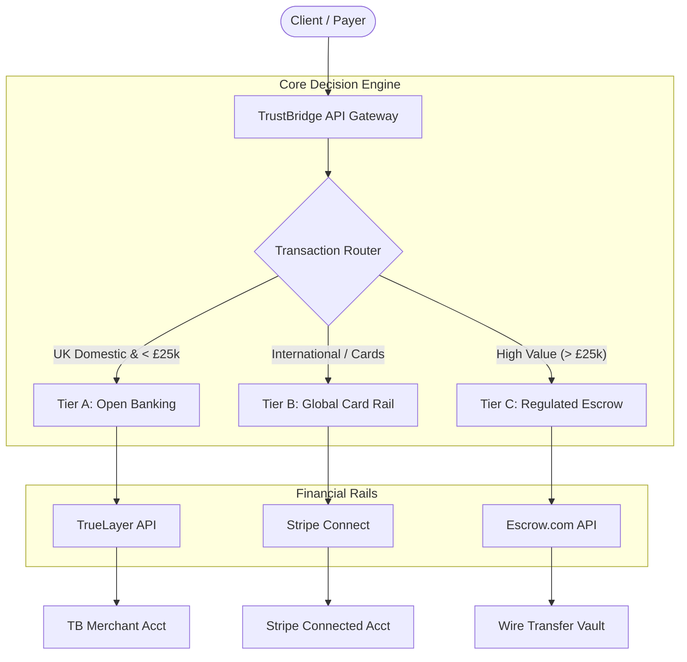

<div align="center">

  <p>&nbsp;</p>

  

  <br/>

### The Hybrid Payment Router for the Construction Industry

[](https://github.com/your-repo/actions)
[](https://veracode.com)
[](https://openjdk.org)
[](https://spring.io)
[](#)

<p align="center">
  <a href="#-executive-summary">Summary</a> •
  <a href="#-system-architecture">Architecture</a> •
  <a href="#-security--compliance">Security</a> •
  <a href="#-quick-start-local-development">Quick Start</a>
</p>

</div>

---

## 📖 Executive Summary

**TrustBridge** is a vertical fintech platform designed to solve the cash-flow latency crisis in the UK construction sector.

Unlike generic payment gateways, TrustBridge operates as a **Smart Payment Router**. It dynamically routes transactions based on risk, volume, and geography to optimize for **margin** (via Open Banking) and **compliance** (via regulated Escrow partners).

**Core Value Proposition:**
* **Cost Efficiency:** **1%** transaction fees for domestic payments (vs. 2.9% industry standard).
* **Risk Mitigation:** "No-Code" Escrow workflows that protect both Contractor and Client.
* **Vertical Logic:** Built-in milestone management and evidence-based release triggers.

---

## 🏗 System Architecture

TrustBridge employs a **Hybrid Routing Engine** to switch between payment rails dynamically.



### Routing Logic (Proprietary)

The system automatically selects the compliance and fee structure based on the user's geolocation and transaction size.

| Tier | Condition | Infrastructure Rail | Fee Structure | Compliance Model |
|------|-----------|-------------------|---------------|------------------|
| Tier A | UK Domestic (GBP) | TrueLayer (PISP) | 1.0% (Platform Fee) | Commercial Agent (FCA Exemption) |
| Tier B | International (USD/EUR) | Stripe Connect | 5.0% (Surcharge) | Marketplace Facilitator |
| Tier C | High Value (> £25k) | Escrow.com | Broker Fee | Fully Regulated Escrow Partner |

---

## 🔒 Security & Compliance

TrustBridge adheres to strict financial compliance standards.

### 🛡️ Regulatory Status

- **UK Operations:** Operates under the Commercial Agent Exemption (The Electronic Money Regulations 2011). TrustBridge acts strictly as the commercial agent authorized to negotiate or conclude the sale of services on behalf of the Payee (Freelancer).
- **Data Sovereignty:** All UK user data is residency-locked to eu-west-2 (London).

### 🔐 Technical Security Measures

- **Zero-Trust Payouts:** Funds cannot be released without cryptographically signed approval from the Client OR a Dispute Resolution verdict.
- **Immutable Audit Logs:** All state transitions (e.g., FUNDED -> RELEASED) are recorded in a write-only ledger (transactions table).
- **State Machine Enforcement:** Financial states are managed by Spring State Machine to prevent illegal transitions (e.g., preventing a "Draft" job from triggering a "Payout").

---

## 🛠 Technology Stack

Designed for ACID Compliance, High Availability, and Auditability.

<table align="center">
<tr>
<td align="center" width="96">
<br>Java 21
</td>
<td align="center" width="96">
<br>Spring Boot 3
</td>
<td align="center" width="96">
<br>PostgreSQL 16
</td>
<td align="center" width="96">
<br>Docker
</td>
</tr>
</table>

- **Core Framework:** Spring Boot 3.2 (Web, Data JPA, Security)
- **Database Migration:** Flyway
- **Testing:** JUnit 5, Testcontainers, Mockito
- **Integration:** OpenFeign (for external Banking APIs)

---

## 🚀 Quick Start (Local Development)

### Prerequisites

- ☕ Java 21 or higher
- 🐳 Docker & Docker Compose
- 🔑 TrueLayer Sandbox Keys (Contact Admin)

### Installation

#### 1. Clone the Repository

```bash
git clone https://github.com/trustbridge-io/core-platform.git
cd core-platform
```

#### 2. Initialize Infrastructure

```bash
# Spins up PostgreSQL and Redis containers
docker-compose up -d
```

#### 3. Configure Environment

Create a `.env` file in the root directory:

```ini
TRUELAYER_CLIENT_ID=your_id
TRUELAYER_CLIENT_SECRET=your_secret
DB_URL=jdbc:postgresql://localhost:5432/trustbridge
```

#### 4. Run Application

```bash
./gradlew bootRun --args='--spring.profiles.active=dev'
```

---

## 🗺️ Roadmap

### Phase 1: UK Domestic MVP (Current)

- [x] Core Banking Ledger (jobs, milestones, ledgers).
- [x] TrueLayer Payment Initiation (PISP) integration.
- [ ] Evidence Upload System (S3 Integration).
- [ ] Dispute Resolution Dashboard.

### Phase 2: International Expansion (Future)

- [ ] Stripe Connect (Express) implementation.
- [ ] Multi-currency support (USD, EUR).
- [ ] Automated Tax Calculation (VAT/Sales Tax).

---

## 📄 License & Proprietary Notice

**Copyright © 2025 TrustBridge Financial Ltd.**  
All rights reserved. This software is proprietary and confidential. Unauthorized copying, transfer, or use of this file, via any medium, is strictly prohibited.

TrustBridge Ltd is a company registered in England and Wales.

---

<div align="center">
<sub>Built with precision in London, UK 🇬🇧</sub>
</div>
<br>